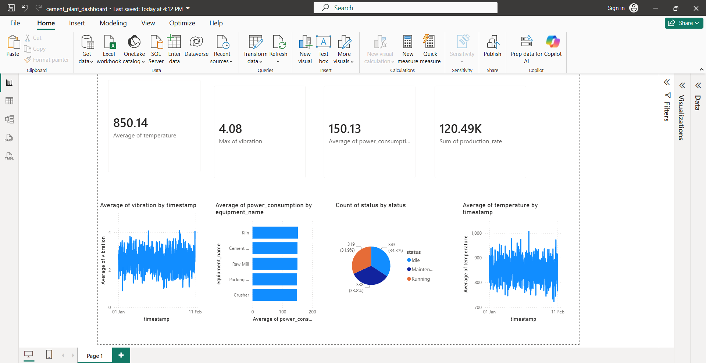

# Cement Plant Sensor Data Analysis & ETL Pipeline

A Data Engineering project that simulates cement plant sensor data processing using Python, SQL, SQLite, and Power BI.

## Features

* Sensor data generation
* ETL pipeline implementation
* Data cleaning and validation
* SQL analytics
* Equipment performance analysis
* Power BI dashboard visualization

## Tech Stack

* Python
* Pandas
* NumPy
* SQLite
* SQL
* Matplotlib
* Power BI

## Dashboard

## Skills Demonstrated

ETL • Data Engineering • SQL • Data Cleaning • Data Analysis • Power BI

## Author

Siddharth Kumawat

This project was developed for learning and portfolio purposes.
